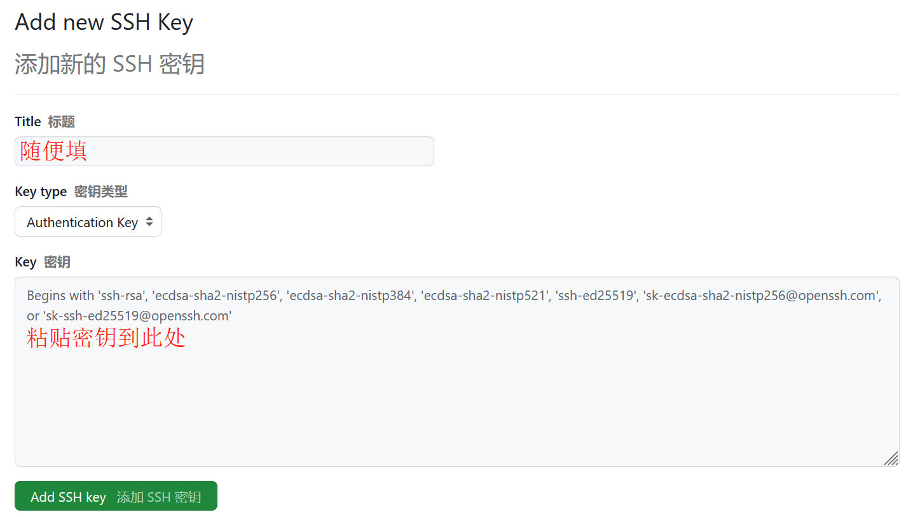

<!--more-->

以下教程适用于 Windows11 64bit 操作系统，并使用 Hugo-Fixit 主题进行说明。

## 1. 安装软件

### 1.1 Hugo（博客引擎）

[Hugo](https://gohugo.io/) 是一个用 Go 语言 编写的静态网站生成器，可以快速地生成高效、安全和易于管理的静态网站，具有速度快、可定制性强、易于使用等特点。

下载[Hugo 扩展版本](https://github.com/gohugoio/hugo/releases)（≥ v0.146.0），如`Hugo_extended_0.147.8_windows-arm64.zip`，解压至 `D:\Hugo`，并将解压后的文件夹重命名为 `bin`。

设置环境变量的步骤如下（关键！）：

① `win+s`搜索“环境变量”，选择“编辑系统环境变量”。

② 点击“环境变量”，在“系统变量”中找到`Path`，点击“编辑”->“新建”。

③ 输入`D:\Hugo\bin`，确认保存。

④ 验证安装：`win+r`输入`cmd`回车，输入以下命令出现版本号即安装成功。

```cmd
hugo version
```

### 1.2 Git（代码管理）

[Git](https://git-scm.com/) 是一个开源的分布式版本控制系统，用于跟踪代码变更、管理代码历史、并支持多人协作开发。

下载并安装[Git](https://git-scm.com/downloads)，安装时所有选项保持默认，完成后在桌面右键能看到“Git Bash here”选项。`win+r`输入`cmd`回车，输入以下命令出现版本号即安装成功。

```cmd
git version
```

### 1.3 VSCode（编辑器）

[‌Visual Studio Code](https://code.visualstudio.com/)（简称 VS Code）‌ 是由微软开发的一款免费、开源的跨平台代码编辑器，支持语法高亮、代码自动补全、代码重构、查看定义功能，并且内置了命令行工具和 Git 版本控制系统。

下载并安装[Visual Studio Code](https://code.visualstudio.com/Download)，安装时勾选所有附加任务，其他选项保持默认，完成后在桌面右键能看到“通过 code 打开”选项。


首次打开后，`ctrl+shift+x`调出扩展界面，搜索“Chinese”，安装“Chinese (Simplified) Language Pack”，右下角提示重启时点击“Restart Now”，重启后即可使用中文界面。

## 2. 创建站点

打开 `D:\Hugo`文件夹，空白处右键选择“通过 code 打开”，打开顶部菜单栏的“终端”，选择“新建终端”，在底部面板点击“+”选择“Git Bash”。


Git Bash 终端输入以下命令：

```bash
hugo new site blog
cd blog
git init
git submodule add https://github.com/hugo-fixit/FixIt.git themes/FixIt
echo "theme = 'FixIt'" >> hugo.toml
echo "defaultContentLanguage = 'zh-cn'" >> hugo.toml
```

命令解释：

```bash
# 在 blog 目录中创建项目的目录结构
hugo new site blog
# 将当前目录更改为项目的根目录
cd blog
# 在当前目录中初始化一个空的 Git 仓库
git init
# 将 FixIt 主题克隆到 themes 目录，将其作为 Git 子模块添加到项目中
git submodule add https://github.com/hugo-fixit/FixIt.git themes/FixIt
# 在站点配置文件中追加一行，指示当前主题
echo "theme = 'FixIt'" >> hugo.toml
# 在站点配置文件中追加一行，指示默认内容语言
echo "defaultContentLanguage = 'zh-cn'" >> hugo.toml
```

## 3. 配置站点

不要修改`themes`文件夹的任何东西！！！最好在`D:\Hugo\blog`创建同名文件夹后再进行修改。

在站点主配置（`D:\Hugo\blog\hugo.toml`）中添加以下内容：

```toml
ignoreLogs = ['warning-dev-version']
# 以下配置表示继承 FixIt 主题的 markup，outputs 和 taxonomies 配置
[markup]
  _merge = "shallow"
[outputs]
  _merge = "shallow"
[taxonomies]
  _merge = "shallow"
```

创建`D:\Hugo\Blog\config\_default`文件夹，并复制粘贴`D:\Hugo\Blog\themes\FixIt\hugo.toml`文件到该文件夹，现在目录结构变成：

```text
blog
├─ config
│  └─ _default
│     └─ hugo.toml      # 主题配置文件（主要修改这个）
├─ themes
│  └─ FixIt            # 不要修改里面的文件！
│     ├─ hugo.toml
└─ hugo.toml            # 站点主配置文件（能不动就不动！）
```

Git Bash 终端输入以下任一命令预览网页：

```bash
# 启动 Hugo 的开发服务器以查看站点
hugo server
hugo server -D                # 包括标记为draft的内容
hugo server -D --disableFastRender  # 在更改时启用完全重新渲染
hugo server -e production         # 支持启用评论系统和CDN等的本地预览命令
# 按 Ctrl + C 停止 Hugo 的开发服务器
```

打开 <http://localhost:1313/>即可预览网页，修改主题配置文件的同时可以实时预览网页变化。如未出现网址，可能是主题配置文件出现了语法错误，根据终端显示的错误逐一修改即可，原因是 Hugo 版本迭代后有些语法可能会被弃用，但主题创作者未及时更新，比如：

```toml
# 每页默认帖子数量
[pagination]      # paginate 已弃用
  pagerSize = 12
# 永久链接配置
[Permalinks]
  posts = ":contentbasename"  # :filename 已弃用
  # posts = ":year/:month/:filename"
  # posts = "posts/:slugorfilename"
```

修改完毕后，再次输入命令打开网址即可。

## 4. 创建文章

### 4.1 Front matter

[Front matter](https://gohugo.io/content-management/front-matter/) 是一组结构化元数据，通过标准化的字段描述文档属性，如标题、日期、分类、标签、合集等。

打开`D:\Hugo\Blog\themes\FixIt\archetypes`文件夹，将`posts.md`复制并粘贴到`D:\Hugo\Blog\archetypes`。

```text
blog
├─ archetypes             # 修改 Front matter
│  ├─ default.md
│  └─ posts.md
├─ content               # 生成和管理文章
│  └─ posts
……
├─ themes                # 不要修改里面的文件！
│  └─ FixIt
│     ├─ archetypes
│     │  ├─ posts.md
……
```

打开复制后的`posts.md`，按需保留所需的属性，示例如下：

```toml
---
title: "{{ replace .Name "-" " " | title }}"
description: "{{ replace .Name "-" " " | title }}"
date: {{ .Date }}
lastmod: {{ .Date }}
categories: ["分类"]
collections: ["合集"]
---
<!--more-->
```

> 📌 **注意**：
>
> - 不是所有的 Front matter 都必须在每篇文章中设置，只有在文章的参数和你的主题配置中的`page`部分不一致时才有必要这么做。
> - 摘要生成优先顺序：
>   - 有分隔符`<!--more-->`，且前面没有内容，变量`description`作为摘要。
>   - 有分隔符`<!--more-->`，且前面有内容，则这部分内容作为摘要。
>   - Front matter 中有变量`summary`，则使用其为摘要。
>   - 上述都没有，Hugo 将自动提取内容的前 70 个单词作为摘要。

### 4.2 内容组织

图片是文章常见的资源之一，你可以通过图床存储图片（引用绝对路径），或者将图片存储在本地目录（引用相对路径）。下面重点讲一下本地存储方式。

```text
blog
├─ assets
│  ├─ images
│     ├─ pic001.png
├─ content
│  └─ posts
│     ├─ test001
│     │  ├─ index.md
│     │  ├─ pic001.png
│     │  └─ pic002.png
├─ static
│  ├─ images
│     ├─ pic001.png
```

使用[Page bundles](https://gohugo.io/content-management/page-bundles/)将一个或多个资源与内容逻辑关联，也就是直接使用相对于当前页面目录的文件路径来引用页面资源，如``。

使用“assets”或“static”目录存储图片资源，引用资源的文件路径是相对于该目录的，如``或``。

> 📌 **注意**：
>
> 图片的命名必须采用英文字符，如`pic001.png`，采用中文字符或有空格，图片将无法正常显示，如`图片 001.png`

两种方式生成文章的命令有所不同，如果是第一种则用第一条命令，自行替换`title`字符，不要使用中文字符。生成后，你将在`content`目录找到对应的文件，打开进行修改即可。

```bash
hugo new posts/title/index.md
hugo new posts/title.md
```

此外，在构建和部署网站之前，新建`D:\Hugo\blog\README.md`文件，里面填写你对仓库的介绍即可，示例如下：

```markdown
Hugo + FixIt 博客
```

## 5. 构建和部署

[GitHub](https://github.com/)是一个基于 Git 版本控制系统的代码托管平台，提供静态网站托管服务（[GitHub Pages](https://docs.github.com/zh/pages/getting-started-with-github-pages)），可自动构建并发布 Hugo 生成的博客。[GitHub Actions](https://docs.github.com/zh/actions) 是其内置的自动化工具，只需提交代码，即可自动完成博客的构建、测试与在线发布。


### 5.1 创建 GitHub 仓库

打开[Github](https://github.com/)，注册并登录账号，点击头像，选择“Your repositories”进入仓库，点击绿色按钮“New”新建仓库。

GitHub 默认提供`.github.io`域名给用户使用，且具有唯一性，也就是说“Repository name”填写`owner.github.io`，将会生成<http://owner.github.io>网址，其它则会生成<http:/owner.github.io/XXX>网址。


点击“Create Repository”创建仓库，之后打开主题配置文件，修改以下内容，并修改站点配置文件的`baseURL`参数。

```toml
baseURL = "https://<用户名>.github.io/"
enableGitInfo = true
[params.gitInfo]
    repo = "https://github.com/<用户名>/<用户名>.github.io/"
```

点击仓库的“Settings->Pages->Build and deployment”，将“Source”修改为“GitHub Actions”。


### 5.2 配置 SSH 密钥

SSH 密钥是一种安全的身份验证方法，用于在远程服务器和客户端之间建立安全连接。使用 SSH 密钥可以替代传统的密码身份验证，提供更高的安全性和便利性。

Git Bash 终端输入以下命令（自行替换引号内的相应字段），中途会询问是否需要密码，直接按三次回车即可。

```bash
git config --global user.name "username"
git config --global user.email  "user@email.com"
ssh-keygen -t ed25519 -C "user@email.com"
cat ~/.ssh/id_ed25519.pub
```

复制密钥内容，回到 Github，点击头像，选择“Settings->“SSH and GPG keys”->“New SSH key”，粘贴密钥到`Key`位置，标题随意，填写后点击“Add SSH Key”。



Git Bash 终端输入以下命令，出现“You've successfully authenticated……”，则表示配置成功。

```bash
ssh -T git@github.com
```

### 5.3 创建 Workflows

[Workflows](https://docs.github.com/zh/actions/writing-workflows/about-workflows)是 GitHub Actions 的自动化流水线，用一份配置文件定义“博客构建 → 测试 → 发布”步骤。后续每次推送代码到 GitHub，自动触发流程完成博客更新。

Git Bash 终端输入以下命令：

```bash
mkdir -p .github/workflows
touch .github/workflows/hugo.yaml
```

此命令将在`D:\Hugo\blog\.github\workflows`目录生成`hugo.yaml`文件，复制并粘贴以下内容到该文件，并修改`HUGO_VERSION`参数值（执行`hugo version`命令可获取），如`0.147.8`。

```yaml
# Sample workflow for building and deploying a Hugo site to GitHub Pages
name: Deploy Hugo site to Pages

on:
  # Runs on pushes targeting the default branch
  push:
    branches:
      - main

  # Allows you to run this workflow manually from the Actions tab
  workflow_dispatch:

# Sets permissions of the GITHUB_TOKEN to allow deployment to GitHub Pages
permissions:
  contents: read
  pages: write
  id-token: write

# Allow only one concurrent deployment, skipping runs queued between the run in-progress and latest queued.
# However, do NOT cancel in-progress runs as we want to allow these production deployments to complete.
concurrency:
  group: "pages"
  cancel-in-progress: false

# Default to bash
defaults:
  run:
    shell: bash

jobs:
  # Build job
  build:
    runs-on: ubuntu-latest
    env:
      HUGO_VERSION: 0.147.8
      HUGO_ENVIRONMENT: production
      TZ: America/Los_Angeles
    steps:
      - name: Install Hugo CLI
        run: |
          wget -O ${{ runner.temp }}/hugo.deb https://github.com/gohugoio/hugo/releases/download/v${HUGO_VERSION}/hugo_extended_${HUGO_VERSION}_linux-amd64.deb \
          && sudo dpkg -i ${{ runner.temp }}/hugo.deb
      - name: Install Dart Sass
        run: sudo snap install dart-sass
      - name: Checkout
        uses: actions/checkout@v4
        with:
          submodules: recursive
          fetch-depth: 0
      - name: Setup Pages
        id: pages
        uses: actions/configure-pages@v5
      - name: Install Node.js dependencies
        run: "[[ -f package-lock.json || -f npm-shrinkwrap.json ]] && npm ci || true"
      - name: Cache Restore
        id: cache-restore
        uses: actions/cache/restore@v4
        with:
          path: |
            ${{ runner.temp }}/hugo_cache
          key: hugo-${{ github.run_id }}
          restore-keys: hugo-
      - name: Configure Git
        run: git config core.quotepath false
      - name: Build with Hugo
        run: |
          hugo \
            --gc \
            --minify \
            --baseURL "${{ steps.pages.outputs.base_url }}/" \
            --cacheDir "${{ runner.temp }}/hugo_cache"
      - name: Cache Save
        id: cache-save
        uses: actions/cache/save@v4
        with:
          path: |
            ${{ runner.temp }}/hugo_cache
          key: ${{ steps.cache-restore.outputs.cache-primary-key }}
      - name: Upload artifact
        uses: actions/upload-pages-artifact@v3
        with:
          path: ./public

  # Deployment job
  deploy:
    environment:
      name: github-pages
      url: ${{ steps.deployment.outputs.page_url }}
    runs-on: ubuntu-latest
    needs: build
    steps:
      - name: Deploy to GitHub Pages
        id: deployment
        uses: actions/deploy-pages@v4
```

### 5.4 推送 GitHub 仓库

由于 GitHub Actions 会自动重建`public`目录，所以不推送该目录至 GitHub 仓库，且将该目录添加到`.gitignore`，Git Bash 终端输入以下命令：

```bash
cat > .gitignore <<EOL
# 忽略生成目录
/public
/resources/_gen
.hugo_build.lock

# 忽略系统文件
.DS_Store
EOL
```

Git Bash 终端输入以下命令，推送网站到 GitHub 仓库，记得将 git 地址替换成你的。

```bash
git add -A
git commit -m "first commit"
git branch -M main
git remote add origin git@github.com:username/username.github.io.git  # 记得修改git地址
git push -u origin main
```

打开 GitHub 仓库，选择“Actions”，你将看到“All workflows”，当 GitHub 完成构建和部署网站后，状态指示器的颜色将变成绿色。


点击“Settings”->“Pages”->“GitHub Pages”->“Visit site”访问博客。

之后每当你从本地仓库推送更改时，只要在 Git Bash 终端输入以下命令，GitHub Actions 将自动重构你的网站并部署这些更改。自行替换引号内的内容，这表明你本次提交了什么更改。

```bash
git add -A
git commit -m "修改v1.0"
git push
```

## 参考内容

1. [Hugo Quick start](https://gohugo.io/getting-started/quick-start/)
2. [FixIt 快速上手](https://fixit.lruihao.cn/zh-cn/documentation/getting-started/quick-start/)
3. [Host on GitHub Pages](https://gohugo.io/host-and-deploy/host-on-github-pages/)
