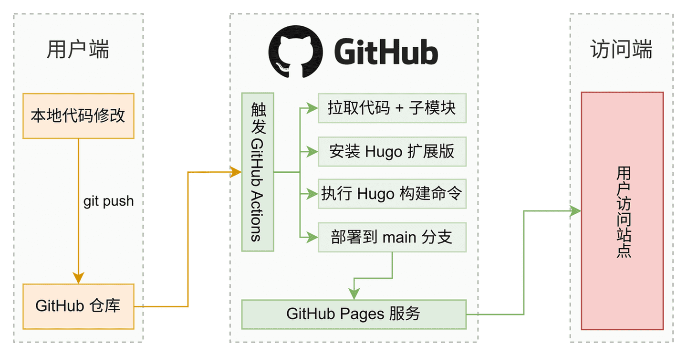
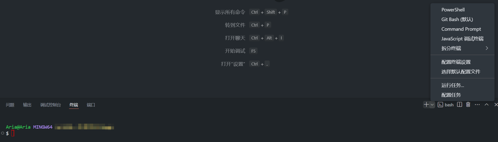
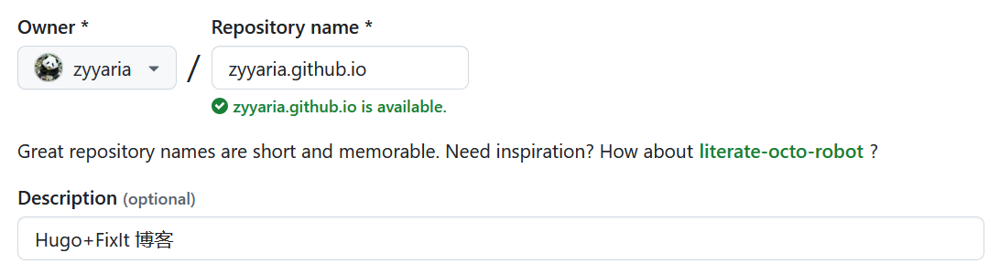
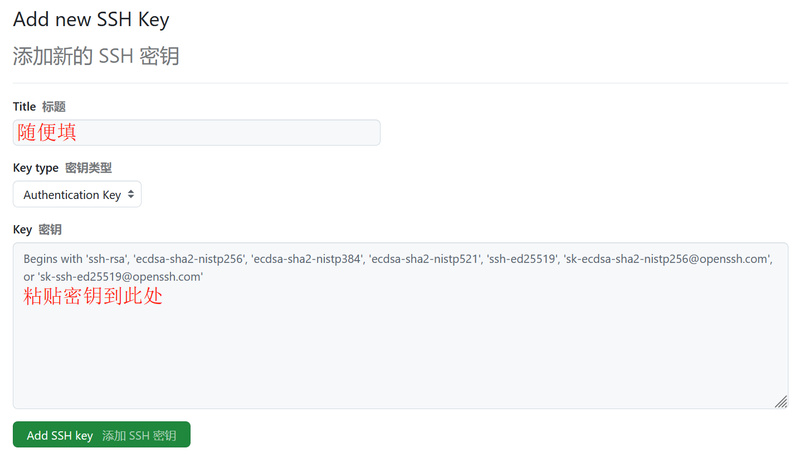
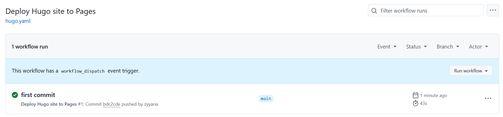
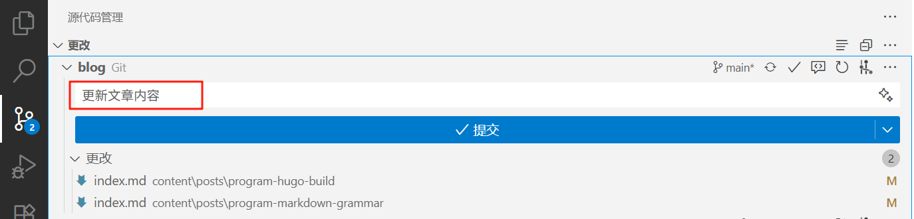

<!--more-->

传统静态博客部署需要本地构建后手动上传，多设备协作时效率受限。如何建立 Markdown 推送触发的自动化发布流程？本文通过 [Hugo](https://gohugo.io/) 集成 [GitHub Actions](https://docs.github.com/zh/actions) 自动化流水线，减少环境依赖，保障写作流程的连贯性。



## 1. 安装必备软件

### 1.1 Hugo（博客引擎）

[Hugo](https://gohugo.io/) 是用 Go 语言编写的静态网站生成器，能以毫秒级速度将 Markdown 转换为 HTML 页面，是构建博客的核心工具。

① **下载扩展版**

打开 [Hugo Releases](https://github.com/gohugoio/hugo/releases) 下载标有 `extended` 且匹配操作系统的 `.zip` 文件，要求版本 ≥ v0.146.0，如 `Hugo_extended_0.147.8_windows-arm64.zip`。

② **解压与重命名**

将下载的 `.zip` 文件解压至 `D:\Hugo` 目录，并将解压后的文件夹重命名为 `bin` ，最终路径应为 `D:\Hugo\bin` 。

③ **设置环境变量**（❗❗）

按 `Win+S` 搜索 “环境变量” ，打开 “编辑系统环境变量” ，在 “系统属性” 窗口点击 “环境变量” ，在 “系统变量” 区域找到 `Path` ，点击 “编辑” → “新建” ，输入 `D:\Hugo\bin` ，逐层点击 “确定” 保存。

④ **验证安装**

按 `Win+R` 输入 `cmd` ，打开命令提示符，输入以下命令出现版本号即安装成功。

```cmd
hugo version
```

### 1.2 Git（代码管理）

[Git](https://git-scm.com/) 是分布式版本控制系统，用于追踪博客源码变更历史。

① **下载安装**

下载并安装 [Git](https://git-scm.com/downloads)，安装时所有选项保持默认。

② **验证安装**

右键点击任意文件夹或文件，检查菜单是否出现 “Git Bash here” 选项，并按 `Win+R` 输入 `cmd` ，打开命令符，输入以下命令出现版本号即安装成功。

```cmd
git version
```

### 1.3 VSCode（编辑器）

[‌Visual Studio Code](https://code.visualstudio.com/)（简称 VS Code）‌ 提供 Markdown 编辑、实时预览和 Git 集成功能，是管理博客源码的高效编辑器。

① **下载安装**

下载并安装 [VS Code](https://code.visualstudio.com/Download)，安装时在 “选择附加任务” 页面勾选所有复选框（特别是 “添加到 PATH” ），其他选项保持默认。

② **验证安装**

右键点击任意文件夹或文件，检查菜单是否出现 “通过 code 打开” 选项。

③ **设置中文界面（可选）**

打开 VSCode，按 `Ctrl+Shift+X` 调出扩展界面，搜索并安装 “Chinese (Simplified) Language Pack” 。安装完成后点击右下角 “Restart Now” 重启生效。

## 2. 创建与配置站点

### 2.1 初始化站点

① **打开终端**

在 `D:\Hugo` 文件夹空白处右键选择 “通过 code 打开” ，在 VSCode 顶部菜单栏点击 “终端” → “新建终端”，在底部面板点击 `+` 选择 “Git Bash” 。



② **执行创建命令**

在 Git Bash 终端输入以下命令将生成项目根目录 ( `D:\Hugo\blog`)：

```bash
hugo new site blog
cd blog
git init
git submodule add https://github.com/hugo-fixit/FixIt.git themes/FixIt
echo "theme = 'FixIt'" >> hugo.toml
echo "defaultContentLanguage = 'zh-cn'" >> hugo.toml
```

命令解释：

```bash
# 在 blog 目录中创建项目的目录结构
hugo new site blog
# 将当前目录更改为项目的根目录
cd blog
# 在当前目录中初始化一个空的 Git 仓库
git init
# 将 FixIt 主题克隆到 themes 目录，将其作为 Git 子模块添加到项目中
git submodule add https://github.com/hugo-fixit/FixIt.git themes/FixIt
# 在站点配置文件中追加一行，指示当前主题
echo "theme = 'FixIt'" >> hugo.toml
# 在站点配置文件中追加一行，指示默认内容语言
echo "defaultContentLanguage = 'zh-cn'" >> hugo.toml
```

### 2.2 配置文件设置

> - 所有路径基于项目根目录：`D:\Hugo\blog` 作为基准路径。
> - ❗ 不要直接修改 `themes/FixIt` 文件夹的任何内容！主题更新时会覆盖修改！

① **修改主配置**

打开 `hugo.toml` ，在末尾添加以下内容：

```toml
ignoreLogs = ['warning-dev-version']  # 忽略开发版本警告
# 以下配置表示继承 FixIt 主题的 markup，outputs 和 taxonomies 配置
[markup]
  _merge = "shallow"
[outputs]
  _merge = "shallow"
[taxonomies]
  _merge = "shallow"
```

② **创建主题配置**

新建 `config/_default` 目录，复制 `themes/FixIt/hugo.toml` 到该文件夹。目录结构如下：

```text
blog
├─ config
│  └─ _default
│     └─ hugo.toml      # ✅ 主题配置（主要修改这个）
├─ themes
│  └─ FixIt             # ❌ 不要修改此目录内容
│     ├─ hugo.toml      # 主题原始配置
└─ hugo.toml            # 站点主配置（尽量不修改）
```

### 2.3 实时预览与调试

① **启动开发服务器**

在 Git Bash 终端输入以下任一命令预览网页：

```bash
# 启动 Hugo 的开发服务器以查看站点
hugo server                         # 基础预览
hugo server -D                      # 包括标记为 draft 的内容
hugo server -D --disableFastRender  # 在更改时启用完全重新渲染
hugo server -e production           # 生产模式（支持评论 / CDN）
# 按 Ctrl + C 停止 Hugo 的开发服务器
```

② **访问与调试**

浏览器打开 <http://localhost:1313/> ，修改 `config/_default/hugo.toml` 后页面会自动刷新。

③ **常见错误修复**

如果出现错误提示，查看终端提示的信息并逐一修改，有可能是 Hugo 版本迭代出现的语法兼容性错误，修正后重启服务器即可。比如：

```toml
# 每页默认帖子数量
[pagination]      # paginate 已弃用
  pagerSize = 12
# 永久链接配置
[Permalinks]
  posts = ":contentbasename"  # :filename 已弃用
  # posts = ":year/:month/:filename"
  # posts = "posts/:slugorfilename"
```

## 3. 内容创作与管理

### 3.1 Front matter

Front matter 是一组结构化元数据，通过标准化的字段描述文档属性，如标题、日期、分类等。详细了解请参考 [Hugo 官方文档](https://gohugo.io/content-management/front-matter/)。

① **复制模板文件**

复制 `themes/FixIt/archetypes/posts.md` 到 `archetypes` 文件夹。目录结构如下：

```text
blog
├─ archetypes            # 存放自定义模板
│  ├─ default.md
│  └─ posts.md           # 文章模板
├─ content               # 文章存放目录
│  └─ posts
……
├─ themes
│  └─ FixIt
│     ├─ archetypes
│     │  ├─ posts.md
……
```

② **自定义模板内容**

打开 `archetypes/posts.md` ，按需保留所需的属性。示例如下：

```toml
---
title: "{{ replace .Name "-" " " | title }}"
description: "{{ replace .Name "-" " " | title }}"
date: {{ .Date }}
lastmod: {{ .Date }}
categories: ["分类"]
collections: ["合集"]
---
<!--more-->
```

> 📌 **注意**：Front matter 只需在与主题默认配置不一致时设置。

③ **摘要生成规则**

摘要生成遵循以下优先顺序：

- 有分隔符 `<!--more-->` ，且前面没有内容，变量 `description` 作为摘要。

- 有分隔符 `<!--more-->` ，且前面有内容，则这部分内容作为摘要。

- Front matter 中有变量 `summary` ，则使用其为摘要。

- 上述都没有，Hugo 将自动提取内容的前 70 个单词作为摘要。

### 3.2 资源与文章管理

① **图片存储方案**

图片资源可通过图床和本地存储，前者引用绝对路径，后者引用相对路径。目录结构如下：

```text
blog
├─ assets                 # 全局资源
│  ├─ images
│     ├─ pic001.png
├─ content
│  └─ posts
│     ├─ test001          # 文章专属资源
│     │  ├─ index.md
│     │  ├─ pic001.png
│     │  └─ pic002.png
├─ static                 # 公共资源
│  ├─ images
│     ├─ pic001.png
```

② **引用资源方法**

根据存储位置选择引用方式：

```markdown

 # Page bundles（与文章同一目录）
 # assets 或 static 目录资源
```

> **Page bundles** 将一个或多个资源与内容逻辑关联，也就是直接使用相对于当前页面目录的文件路径来引用页面资源。详细了解请参考 [Hugo 官方文档](https://gohugo.io/content-management/page-bundles/)。

③ **创建新文章**

在 Git Bash 终端输入以下任一命令：

```bash
# 创建带资源目录的文章
hugo new posts/title/index.md

# 创建单文件文章
hugo new posts/title.md
```

> 📌 **重要说明**：
>
> - 文件名必须使用英文字符（中文字符可能导致显示问题）。
> - 生成后编辑 `content/posts/` 下的对应文件。

④ **添加仓库说明**

创建 `README.md` ，撰写你对博客的基础介绍。内容示例如下：

```markdown
# Hugo + FixIt 博客

基于 Hugo 静态网站生成器和 FixIt 主题搭建的个人博客
```

## 4. 自动化部署

### 4.1 配置 GitHub 仓库

[GitHub](https://github.com/) 是一个基于 Git 的代码托管平台，提供静态网站托管服务（[GitHub Pages](https://docs.github.com/zh/pages/getting-started-with-github-pages)），可自动构建并发布 Hugo 生成的博客。

① **创建仓库**

注册并登录 [Github](https://github.com/)，点击头像 → “Your repositories” → “New” 。“Repository name” 填写 `<用户名>.github.io`（将会生成 <http://用户名。github.io>），其余默认，完成后点击 “Create Repository” 。



② **配置部署源**

点击仓库的 “Settings“ → ”Pages“ → ”Build and deployment” ，将 “Source” 修改为 “GitHub Actions” 。


③ **修改站点配置**

修改 `config/_default/hugo.toml`：

```toml
baseURL = "https://<用户名>.github.io/"
enableGitInfo = true
[params.gitInfo]
    repo = "https://github.com/<用户名>/<用户名>.github.io/"
```

### 4.2 设置 SSH 密钥

SSH 密钥是一种安全的身份验证方法，用于在远程服务器和客户端之间建立安全连接。使用 SSH 密钥可以替代传统的密码身份验证，提供更高的安全性和便利性。

① **生成密钥对**

在 Git Bash 终端输入以下命令（替换引号内的相应字段），提示 "Enter passphrase" 时直接按三次回车（不设密码）。

```bash
git config --global user.name "username"
git config --global user.email  "user@email.com"
ssh-keygen -t ed25519 -C "user@email.com"        # 按三次回车
cat ~/.ssh/id_ed25519.pub                        # 复制输出的密钥
```

② **添加公钥到 GitHub**

回到 Github，点击头像 → “Settings“ → “SSH and GPG keys” → “New SSH key” ，粘贴复制的密钥密钥到 `Key` 位置，标题随意，填写后点击 “Add SSH Key” 。



③ **验证连接**

在 Git Bash 终端输入以下命令，出现 “You've successfully ……” 则配置成功。

```bash
ssh -T git@github.com
```

### 4.3 创建 Workflows

[GitHub Actions](https://docs.github.com/zh/actions) 是 GitHub 内置的自动化工具，通过提交代码自动完成博客的构建、测试与发布。[Workflows](https://docs.github.com/zh/actions/writing-workflows/about-workflows) 是 GitHub Actions 的自动化流水线，用一份配置文件定义 “博客构建 → 测试 → 发布” 步骤。后续每次推送代码到 GitHub，自动触发流程完成博客更新。

① **创建工作流文件**

在 Git Bash 终端输入以下命令：

```bash
mkdir -p .github/workflows
touch .github/workflows/hugo.yaml
```

② **配置工作流内容**

打开 `.github/workflows/hugo.yaml` 文件，粘贴以下内容并修改 `HUGO_VERSION` 参数值（执行 `hugo version` 命令可获取），如 `0.147.8`。

```yaml
# Sample workflow for building and deploying a Hugo site to GitHub Pages
name: Deploy Hugo site to Pages

on:
  # Runs on pushes targeting the default branch
  push:
    branches:
      - main

  # Allows you to run this workflow manually from the Actions tab
  workflow_dispatch:

# Sets permissions of the GITHUB_TOKEN to allow deployment to GitHub Pages
permissions:
  contents: read
  pages: write
  id-token: write

# Allow only one concurrent deployment, skipping runs queued between the run in-progress and latest queued.
# However, do NOT cancel in-progress runs as we want to allow these production deployments to complete.
concurrency:
  group: "pages"
  cancel-in-progress: false

# Default to bash
defaults:
  run:
    shell: bash

jobs:
  # Build job
  build:
    runs-on: ubuntu-latest
    env:
      HUGO_VERSION: 0.147.8
      HUGO_ENVIRONMENT: production
      TZ: America/Los_Angeles
    steps:
      - name: Install Hugo CLI
        run: |
          wget -O ${{ runner.temp }}/hugo.deb https://github.com/gohugoio/hugo/releases/download/v${HUGO_VERSION}/hugo_extended_${HUGO_VERSION}_linux-amd64.deb \
          && sudo dpkg -i ${{ runner.temp }}/hugo.deb
      - name: Install Dart Sass
        run: sudo snap install dart-sass
      - name: Checkout
        uses: actions/checkout@v4
        with:
          submodules: recursive
          fetch-depth: 0
      - name: Setup Pages
        id: pages
        uses: actions/configure-pages@v5
      - name: Install Node.js dependencies
        run: "[[ -f package-lock.json || -f npm-shrinkwrap.json ]] && npm ci || true"
      - name: Cache Restore
        id: cache-restore
        uses: actions/cache/restore@v4
        with:
          path: |
            ${{ runner.temp }}/hugo_cache
          key: hugo-${{ github.run_id }}
          restore-keys: hugo-
      - name: Configure Git
        run: git config core.quotepath false
      - name: Build with Hugo
        run: |
          hugo \
            --gc \
            --minify \
            --baseURL "${{ steps.pages.outputs.base_url }}/" \
            --cacheDir "${{ runner.temp }}/hugo_cache"
      - name: Cache Save
        id: cache-save
        uses: actions/cache/save@v4
        with:
          path: |
            ${{ runner.temp }}/hugo_cache
          key: ${{ steps.cache-restore.outputs.cache-primary-key }}
      - name: Upload artifact
        uses: actions/upload-pages-artifact@v3
        with:
          path: ./public

  # Deployment job
  deploy:
    environment:
      name: github-pages
      url: ${{ steps.deployment.outputs.page_url }}
    runs-on: ubuntu-latest
    needs: build
    steps:
      - name: Deploy to GitHub Pages
        id: deployment
        uses: actions/deploy-pages@v4
```

③ **设置忽略文件**

由于 GitHub Actions 会自动重建 `public` 目录，所以不推送该目录至 GitHub 仓库，且将该目录添加到 `.gitignore` ，在 Git Bash 终端输入以下命令：

```bash
cat > .gitignore <<EOL
# 忽略生成目录
/public
/resources/_gen
.hugo_build.lock

# 忽略系统文件
.DS_Store
EOL
```

### 4.4 推送与持续部署

① **首次推送代码**

在 Git Bash 终端输入以下命令，推送网站到 GitHub 仓库，记得将 git 地址替换成你的。

```bash
git add -A
git commit -m "first commit"
git branch -M main
git remote add origin git@github.com:<用户名>/<用户名>.github.io.git
git push -u origin main
```

② **监控部署状态**

打开 GitHub 仓库 “Actions” 页面，状态指示器的颜色变成绿色即表示成功部署。



③ **访问博客网站**

点击仓库的 “Settings” → “Pages” → “GitHub Pages” → “Visit site” 访问博客。

④ **后续更新**

方法一：在 Git Bash 终端输入以下命令，自行替换引号的内容，这表明你本次提交了什么更改。

```bash
git add -A
git commit -m "修改 v1.0"
git push
```

方法二：VSCode 按 `Ctrl+Shift+G` 调出源代码管理窗口，在 “消息” 框输入本次提交的更改，然后点击 “提交” → “同步更改” 。



> 每次推送后 GitHub Actions 将自动重建并部署你的博客。

## 参考内容

1. [Hugo Quick start](https://gohugo.io/getting-started/quick-start/)
2. [FixIt 快速上手](https://fixit.lruihao.cn/zh-cn/documentation/getting-started/quick-start/)
3. [Host on GitHub Pages](https://gohugo.io/host-and-deploy/host-on-github-pages/)
