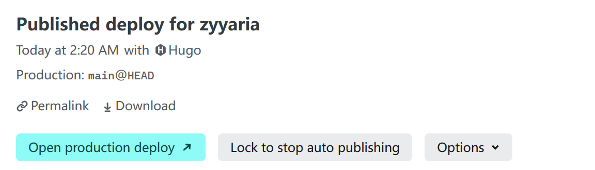

<!--more-->

GitHub Pages 国内访问缓慢且依赖脚本维护，影响内容分发效率。如何同步提升访问速度与简化部署操作？本文采用 [Netlify](https://docs.netlify.com/) 迁移方案，通过全球 CDN 加速优化访问体验，原生支持 Hugo 自动化构建流程。


## 1. 迁移准备

### 1.1 本地仓库

删除 `.github` 文件夹（建议备份到别的目录，包含 `hugo.yaml` 文件）。

打开 `config/_default/hugo.toml` 文件，修改 `baseURL` 参数。

```toml
baseURL = "https://<用户名>.netlify.app/"
```

完成后，将本地仓库推送至 GitHub 仓库。

### 1.2 GitHub 仓库

登录 GitHub 仓库，进入 “Settings” → “Pages” 页面，点击 “Visit site” 旁边的 `···` ，选择 “ Unpublish site ” 。

此操作将立即停用 GitHub Pages 服务，但保留本地历史部署记录。确认后，原访问地址（`http://<usename>.github.io`）将返回 404 状态。

## 2. 配置 Netlify

### 2.1 仓库连接设置

打开 [Netlify](https://app.netlify.com/)，选择 “ Log in with GitHub ” → “ Sign in ” → “Authorize netlify”。

点击 “Project” → “Import from Git” ，选择 “GitHub” → “Authorize netlify” ，在仓库列表选择你的 Hugo 项目仓库。

> 📌 **首次登录 Netlify 用户**：点击 “Configure Netlify on GitHub”，通过选择你的 GitHub 账户来安装 Netlify 应用，点击 “Install” 按钮，点击列表中的 Hugo 项目仓库。

进入 “Configure project and deploy” 页面，修改以下内容：

① `Project name` ：填写上面 `baseURL` 参数的 `<用户名>` 。若显示被占用，则换另一个，同步修改 `baseURL` 参数，并再次从本地推送修改至 GitHub 仓库。

② `Build command` ：修改为 `hugo --gc --minify` 。

③ `Add environment variables`：“Key” 填写 `HUGO_VERSION` ，“Values” 填写本地环境配置的 Hugo 版本号（本地执行 `hugo version` 命令可获取），如 `0.147.8` 。

④ 其余选项保持默认，点击 `Deploy <用户名>` 。

### 2.2 完成部署并访问

在屏幕底部，等待部署完成，完后点击部署日志条目。


点击 “Open production deploy” 按钮查看站点。



## 参考内容

1. [Netlify Docs](https://docs.netlify.com/)
1. [Host on Netlify](https://gohugo.io/host-and-deploy/host-on-netlify/)
