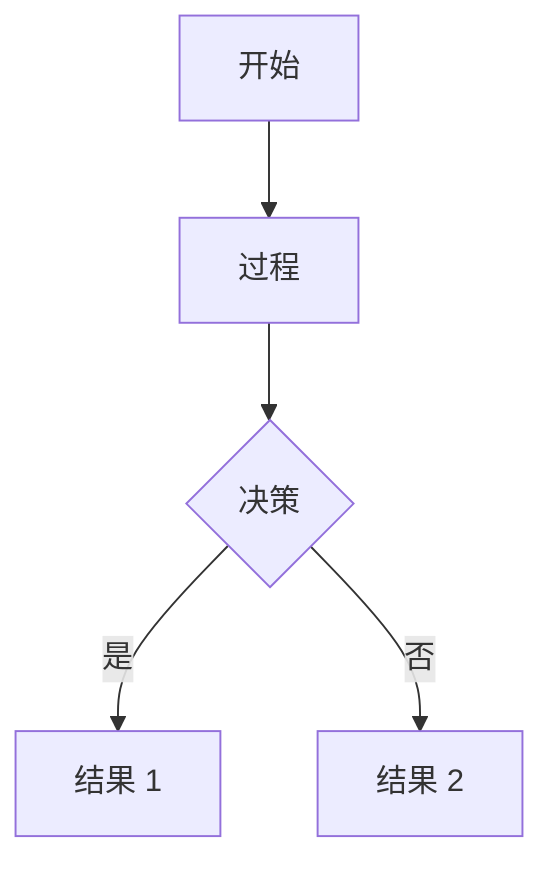

<!--more-->

Markdown 是一种轻量级标记语言，通过纯文本符号（如 `#` 标题、`-` 列表、`>` 引用）实现快速排版，让作者专注内容创作而非样式调整。本手册基于最新实践提供完整语法规则及示例：

## 1. 基础结构

### 1.1 标题

创建标题需在行首添加 1-6 个井号 `#` 后接空格和标题内容，井号 `#` 的数量对应标题级别（1 级标题使用 1 个 `#`，6 级标题使用 6 个 `#`）。

```markdown
# 一级标题

## 二级标题

### 三级标题

#### 四级标题

##### 五级标题

###### 六级标题
```

### 1.2 段落

连续文本行自动合并为段落，段落之间需用空行分隔。段内换行需在行尾添加两个空格或使用 `<br>` 标签，注意直接回车不会产生换行效果。

```markdown
第一段落首行  
第一段落次行（行尾双空格）

第二段落（上方空行分隔）
```

### 1.3 分割线

创建水平分割线需使用三个及以上连字符 `---` 、星号 `***`或下划线`___`，符号必须独占一行且前后无其他内容。注意少于三个符号会被识别为二级标题。

```markdown
上方内容

---

下方内容
```

## 2. 内容区块

### 2.1 列表

① **有序列表**

使用数字加英文句点后接空格和内容（如 `1. 项目`），数字可任意但会按顺序自动修正。多级列表需缩进 4 个空格，多段落内容需相同缩进。

```markdown
1. 第一层级
   1. 子项目（缩进 4 空格）
   2. 子项目二
```

② **无序列表**

使用连字符 `-`、星号 `*` 或加号 `+` 后接空格和内容（如 `- 项目`），全文需保持符号类型统一。符号与内容间必须有空格。

```markdown
- 项目 A
- 项目 B
  - 子项目（避免混用符号）
```

③ **任务列表**

使用 `- [ ]` 表示未完成任务，`- [x]` 表示已完成任务，方括号内必须包含空格。注意方括号与内容间也需空格分隔。

```markdown
- [ ] 未完成任务
- [x] 已完成任务
```

### 2.2 表格

表头行用竖线分隔列（`| 列A | 列B |`），分隔行用冒号指定对齐方式（左对齐 `:---`，居中 `:---:`，右对齐 `---:`）。数据行内容与表头列数需匹配，注意竖线两侧建议保留空格提升可读性。

```markdown
| 左对齐       |   居中对齐   |       右对齐 |
| :----------- | :----------: | -----------: |
| 数据 1       |    数据 2    |       数据 3 |
| 多行<br>文本 | 多行<br>文本 | 多行<br>文本 |
```

### 2.3 代码

① **行内代码**

使用单个反引号`` ` `` 包裹代码片段，适用于短代码或命令的突出显示，例如 `console.log()` 或 `SELECT * FROM users`。注意若代码内包含反引号需使用双反引号包裹 ` `` `。

```markdown
普通代码：`print("Hello")`
含反引号：`` `# 不是标题` `` <!-- 双反引号包裹 -->
特殊字符：`` \` \* \$ `` <!-- 转义符在代码内显示 -->
```

② **代码块**

使用三个反引号 ` ``` ` 创建独立代码块，首行可添加语言标识实现语法高亮（默认语言是`text`）。代码块需独占段落，前后建议空行避免解析冲突。复杂代码需保持正确缩进。

````markdown
```python
# 指定语言实现语法高亮
def hello():
    print("Hello Markdown")
```
````

### 2.4 引用

使用右尖括号 `>` 后接空格和引用内容，多级引用通过叠加 `>` 实现（如 `>>` 二级引用）。引用块内可嵌套其他语法元素，注意每个引用层级需单独成行。

```markdown
> 一级引用
> 延续行
>
> 多段落需空行
>
> > 二级嵌套引用
```

## 3. 专业内容

### 3.1 数学公式

① **行内公式**

使用单美元符号 `$...$` 包裹数学表达式，适用于段落中嵌入的公式。注意符号必须成对出现且紧贴公式内容。

```markdown
质能方程：$E = mc^2$。
```

② **公式块**

使用双美元符号 `$$...$$` 创建独立公式块并居中显示，适用于复杂公式推导。支持 LaTeX 环境如 `\begin{align}...\end{align}`，公式块前后需空行。

```markdown
$$
\begin{bmatrix}
a & b \\
c & d
\end{bmatrix}
$$
```

### 3.2 图表块

使用代码块标注 `mermaid` 创建图表，支持流程图、时序图等类型。注意 Mermaid 语法需严格遵循规范，节点用 `[]` 标识，箭头用 `-->` 连接。

````markdown

````

## 4. 行内格式

### 4.1 文本强调

① **粗体**

使用两个星号 `**` 或两个下划线 `__` 包裹文字创建粗体效果，符号与文字间不可有空格，例如 `**重要内容**` 或 `__关键信息__`。注意全文应保持符号风格一致。

```markdown
**加粗文本**  
**强调内容**
```

② **斜体**

使用单个星号 `*` 或单个下划线 `_` 包裹文字创建斜体效果，符号与文字间不可有空格，例如 `*斜体文字*` 或 `_强调术语_`。注意避免符号与文字间出现空格。

```markdown
_倾斜文本_  
_强调短语_
```

③ **删除线**

使用两个波浪号 `~~` 包裹文字创建删除线效果，例如 `~~过时内容~~`。注意符号必须成对使用且紧贴文字。

```markdown
~~原价 100 元~~  
~~已废弃方法~~
```

④ **高亮**

使用两个等号 `==` 包裹文字创建高亮效果（非标准语法，部分解析器支持），例如 `==重点内容==`。兼容方案为使用 HTML 标签 `<mark>高亮文本</mark>`。

```markdown
==核心概念==  
<mark>关键信息</mark>
```

### 4.2 超链接

① **行内链接**

使用 `[显示文字](实际URL "悬停标题")` 格式创建链接，悬停标题为可选参数。URL 中的空格需编码为 `%20`，特殊字符需转义。

```markdown
[行内链接](https://example.com "可选标题")
```

② **引用链接**

使用 `[显示文字][引用标识]` 格式声明链接，在文档任意位置添加 `[引用标识]: URL "悬停标题"` 定义目标。引用标识不区分大小写，适合重复使用的链接。

```markdown
[引用文本][link-id]

[link-id]: https://example.com "标题"
```

③ **自动链接**

使用尖括号 `< >` 包裹完整 URL 或邮箱自动创建链接，例如 `<https://example.com>` 或 `<contact@example.com>`。注意此方式无法添加自定义文字。

```markdown
访问<https://github.com>  
联系<support@example.com>
```

### 4.3 图片嵌入

基础格式为 ``，支持添加标题 ``。调整尺寸需使用 HTML 标签 ``，注意描述文本对无障碍访问至关重要。

```markdown


带尺寸控制：  

```

### 4.4 特殊元素

① **上下标**

上标使用 `<sup>文字</sup>` 标签，下标使用 `<sub>文字</sub>` 标签。适用于数学公式和化学式，标签必须正确闭合。

Typora 支持波浪号 `~` 包裹创建下标，脱字符 `^` 包裹创建上标。注意这是非标准语法，通用场景推荐使用 HTML 标签。

```markdown
质能方程 E=mc<sup>2</sup> E=mc^2^
水分子 H<sub>2</sub>O H~2~0
```

② **HTML 内嵌标签**

直接使用标准 HTML 标签如 `<kbd>`、`<mark>`、`<small>` 等增强样式。注意标签需完整闭合，且部分解析器会过滤危险标签。

```markdown
图片尺寸：``
颜色标记：`<span style="color:red">红色文本</span>`
折叠区块：`<details><summary>标题</summary>内容</details>`
```

③ **Emoji 表情**

使用冒号包裹的短代码 `:code:` 插入表情，例如 `:smile:` → 😊。注意支持度取决于解析器，常用表情代码需记忆。

```markdown
✅ :white_check_mark: - 任务完成
⚠️ :warning: - 重要警告
❤️ :heart: - 情感表达
🚀 :rocket: - 快速开始
```

## 5. 文档元信息

### 5.1 目录和锚点

① **目录**

在文档任意位置插入 `[TOC]`自动生成标题导航目录（Typora/VSCode 等编辑器支持）。在线平台如 GitHub 需手动创建目录，建议使用锚点跳转方案。。

```markdown
[TOC] <!-- Typora/Obsidian支持 -->

<!-- GitHub 兼容方案 -->

## 目录

- [第一章](#第一章)
- [第二章](#第二章)
```

② **锚点**

在标题后添加 `{#自定义ID}` 创建锚点（如 `## 章节 {#sec1}`），使用 `[链接文字](#自定义ID)`实现跳转。ID 需唯一，空格用`-`替代，特殊符号需避免。

```markdown
## 第一章 {#chapter1} <!-- 自定义 ID -->

跳转到[第一章](#chapter1) <!-- 锚点跳转 -->
```

### 5.2 脚注与注释

① **脚注**

正文插入脚注标记 `[^标签]`（如 `概念[^1]`），在文档任意位置添加 `[^标签]: 说明文字` 定义脚注内容。标签可用数字或字母，自动编号。

```markdown
这是主文本[^1]包含脚注。
[^1]: 脚注详细说明内容。
```

② **注释**

可见注释显示在源码中，不可见注释仅源码可见（需前后空行）。注释不影响渲染结果，适合团队协作说明。

```markdown
<!-- 可见注释 -->

[//]: # "不可见注释"
```

### 5.3 Front matter

文档开头用 `---` 包裹 YAML 格式元数据，支持 `title`、`date`、`tags` 等字段。注意符号必须独占三行，冒号后需空格。

```markdown
---
title: 文档标题
date: 2025-06-15
tags: [标签 1, 标签 2]
category: 分类
---

正文内容...
```

### 5.4 转义机制

① **特殊符号转义**

部分符号在 Markdown 中具有特殊功能，需添加反斜杠 `\` 转义才能作为普通字符显示。反斜杠自身需转义为 `\\`。

```markdown
显示星号：\*  
显示反斜杠：\\  
显示代码符号：\`  
防止公式解析 \$ → $
```

**转义字符表**：

| 符号    | 转义写法 | 说明                     |
| ------- | -------- | ------------------------ | 
| `\`     | `\\`     | 反斜杠自身               |
| `` ` `` | `` \` `` | 代码符号                 |
| `*`     | `\*`     | 星号（避免斜体）         |
| `_`     | `\_`     | 下划线（避免斜体）       |
| `#`     | `\#`     | 井号（避免标题）         |
| `$`     | `\$`     | 美元符号（避免公式）     |
| `~`     | `\~`     | 波浪线（避免下标）       |
| `^`     | `\^`     | 脱字符（避免上标）       |
| `[`     | `\[`     | 左方括号（避免链接）     |
| `]`     | `\]`     | 右方括号（避免链接）     |
| `(`     | `\(`     | 左圆括号（避免链接）     |
| `)`     | `\)`     | 右圆括号（避免链接）     |
| `<`     | `\<`     | 小于号（避免 HTML 标签） | 
| `>`     | `\>`     | 大于号（避免 HTML 标签） | 

② **自动字符转义**

HTML 特殊字符自动转义：`&` → `&amp;`；`<` → `&lt;`；`>`→ `&gt;`。

HTML 实体（如 `&copy;`）直接输出对应符号，数学符号需用 LaTeX。

```markdown
AT&T → AT&amp;T <!-- & 转义 -->
4 < 5 → 4 &lt;5 <!-- < 转义 -->
&copy; → © <!-- HTML 实体保留 -->
```

**转义规则表**：

| 原始字符  | 自动转换 | 说明       | 示例               |
| :--------- | :-------- | :---------- | :-------------- |
| `&`       | `&`      | and 符号   | `AT&T` → AT&T   |
| `<`       | `<`      | 小于号     | `4 < 5` → 4 <5      |
| `>`       | `>`      | 大于号     | `> 0` → >0          |
| `&copy;`  | ©   | 版权符号   | `&copy;` → ©        |
| `&times;` | &times;  | 乘号       | `&times;` → &times; |
| `&nbsp;`  | &nbsp;   | 不间断空格 | `&nbsp;` → &nbsp;   |
| `&gt;`    | &gt;     | 大于号     | `&gt;` → &gt;       |
| `&lt;`    | &lt;     | 小于号     | `&lt;` → &lt;       |
| `&amp;`   | &amp;    | and 符号   |  `&amp;` → &amp; |

## 跨平台支持

| 语法           | GitHub | Typora | 通用方案              |
| -------------- | ------ | ------ | --------------------- |
| 删除线 `~~`    | ✓      | ✓      | 无差异                |
| 高亮 `==`      | ✗      | ✓      | `<mark>`标签          |
| 脚注 `[^1]`    | ✓      | ✓      | 无差异                |
| 上下标 `^` `~` | ✗      | ✓      | HTML`<sub>/<sup>`标签 |
| 折叠块         | ✓      | ✗      | 需 HTML 实现          |
| Mermaid 图表   | ✓      | ✓      | 需开启支持            |

## 参考内容

[Markdown 官方教程](https://markdown.com.cn/)
