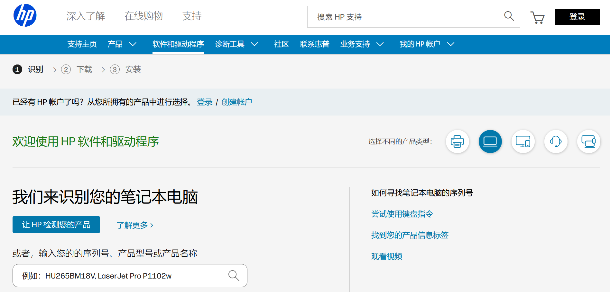
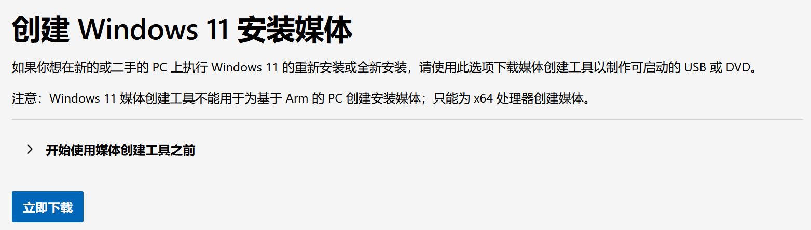
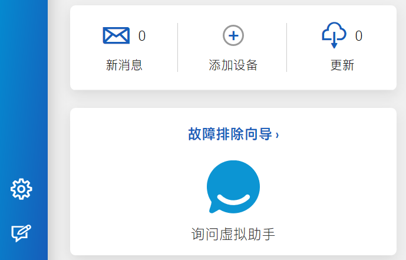
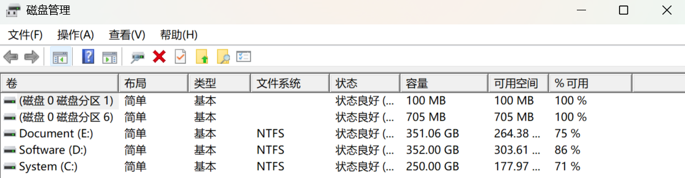

<!--more-->

Media Creation Tool + HP Support Assistant 方案重装系统的优势在于系统纯净无推广软件，激活信息自动关联微软账户，且避免 PE 捆绑工具或恢复分区中的冗余驱动干扰硬件性能。

## 1. 准备工作

### 1.1 必备工具

| 序号 | 工具名称                    | 数量 | 作用                     |
| ---- | --------------------------- | ---- | ------------------------ |
| 1    | 大容量移动硬盘或 U 盘       | 1 个 | 备份重要资料和驱动安装包 |
| 2    | ≥16GB 的 U 盘               | 1 个 | 制作微软官方启动盘       |
| 3    | USB 有线键盘                | 1 个 | 键盘部分失灵时备用       |
| 4    | 支持 USB 网络共享的安卓手机 | 1 台 | 重装后紧急联网解决方案   |

> 💡 **USB 网络共享说明**：
>
> - 将手机作为网卡通过 USB 为电脑提供网络连接。支持小米/华为/荣耀等安卓设备及部分鸿蒙设备。
> - 开启方式：以小米手机为例，数据线连接电脑后，打开手机 “个人热点” 页面，启用 “USB 网络共享”。

### 1.2 数据备份

复制所有重要文件到备份盘（文档/图片/下载/桌面等位置）。重装将清除 C 盘所有数据，未备份文件将永久丢失！

### 1.3 驱动下载

> ❗ 驱动必须保存至备份盘，切记不要放到启动盘内，会被格式化。
>

系统重装后电脑没有任何驱动，而 [HP Support Assistant](https://support.hp.com/cn-zh/help/hp-support-assistant?jumpid=va_r602_cn/zh/any/psg/pl_ot_ob_ds_pd/hpsupportassistant_cc/dt) 支持驱动自动更新安装，但它需要联网使用，所以你需要下载该软件及网卡驱动至备份盘，或者直接使用 USB 网络共享连接电脑和手机（无需下载网卡）。

网卡驱动下载步骤：

① **获取电脑信息**

按 `Win+I` 打开系统设置，选择系统，拉至最后查看系统信息，获取电脑的型号和系统版本及版本号。打开 [HP 软件和驱动程序](https://support.hp.com/cn-zh/drivers/laptops) 页面，输入电脑型号，选定操作系统版本。



② **下载关键驱动**

找到并下载网卡驱动（Realtek 有线网卡驱动 或 英特尔无线网卡驱动）至备份盘。

## 2. 制作启动盘

### 2.1 格式化 U 盘

U 盘右键选择“格式化”，文件系统选择 `FAT32`，勾选“快速格式化”。此操作将清除 U 盘所有数据，请提前备份！

### 2.2 下载官方工具

[Media Creation Tool](https://www.microsoft.com/zh-cn/software-download/windows11) 是微软官方系统部署工具，具有下载纯净 Windows 镜像、创建可启动安装介质、验证系统兼容性等功能。



### 2.3 创建启动盘

下载完成后，右键以管理员身份启动工具，点击 “接受许可条款”，选择“为另一台电脑创建安装介质”，语言/版本/体系保持默认，选择“U 盘”介质类型，选定预处理好的 U 盘等待下载完成，直至出现“你的 U 盘已准备就绪”提示后关闭。

## 3. 系统重装

### 3.1 启动安装程序

保持启动 U 盘插入，关机后再重新开机，开机时连续按 `F9` 键，选择启动菜单中的“USB XXX”选项，按回车确认。

### 3.2 磁盘分区处理

进入 Windows 安装界面，按 `Shift+F10` 打开 CMD 窗口，输入以下命令：

```cmd
diskpart
list disk             # 查看磁盘列表（确认目标磁盘编号）
select disk 0         # 选择系统磁盘（通常为0）
clean                 # ❗彻底清除所有分区（不可逆操作）
convert gpt           # 转换为GPT分区（UEFI启动必需）
exit
exit
```

关闭 CMD 窗口，点击“刷新” ，选择“未分配空间”，点击“下一步”，系统将自动创建分区。

### 3.3 跳过联网激活

进入 OOBE 界面（“让我们为你连接网络”），按 `Shift+F10` 打开 CMD 窗口，输入以下命令：

```cmd
OOBE\BYPASSNRO
```

系统将自动重启，再次进入 OOBE 界面，出现“我没有 Internet 连接”选项，点击“继续执行有限设置”。

> 📌 **注意**：
>
> - OOBE 环境未加载核心驱动导致键盘异常，联网/外设可解决。
> - 若出现字符键失灵，连接并开启 USB 网络共享，或连接 USB 有线键盘，重新打开 CMD 窗口即可正常输入。

### 3.4 完成基础设置

依照提示逐一点击，设置用户名（使用英文，避免软件兼容问题），密码建议留空，关闭所有隐私设置，等待进入桌面。

## 4. 装机配置

### 4.1 网络连接

已下载网卡驱动的，安装下载的网卡驱动，重启电脑，连接宽带或 WiFi。使用 USB 网络共享的，用数据线连接手机与电脑，开启手机"USB网络共享"。

### 4.2 驱动安装

联网后安装 [HP Support Assistant](https://support.hp.com/cn-zh/help/hp-support-assistant?jumpid=va_r602_cn/zh/any/psg/pl_ot_ob_ds_pd/hpsupportassistant_cc/dt)，打开软件并点击主页面仪表板中的“更新” ，自动扫描并安装所有缺失驱动，完成后重启电脑。



### 4.3 系统更新

重启后，按 `Win+I` 进入设置，选择“Windows 更新”，点击"检查更新"，并下载所有可用更新，安装后重启电脑。

### 4.4 磁盘分区（可选）

① **打开磁盘管理**

按 `Win+X` 选择“磁盘管理”，或 `Win+R` 输入 `diskmgmt.msc`，打开磁盘管理。

② **压缩 C 盘**

右键点击 C 盘，选择“压缩卷”，输入要分出的空间大小（如分100GB新盘 → 输入102400），点击“压缩”，建议至少保留 C 盘 100GB 以上的空间。

③ **创建新分区**

右键点击“未分配的空间”，选择“新建简单卷”，按向导默认设置，完成时会自动格式化并分配盘符。



> 🛑 **分区注意事项**：
>
> - 分区前确保 C 盘至少有 20% 的剩余空间，且关闭所有正在运行的程序。
> - 不要动磁盘管理中的“恢复分区”和“EFI 系统分区”！！！
> - 分区数量和大小建议：根据个人使用需求选择。
