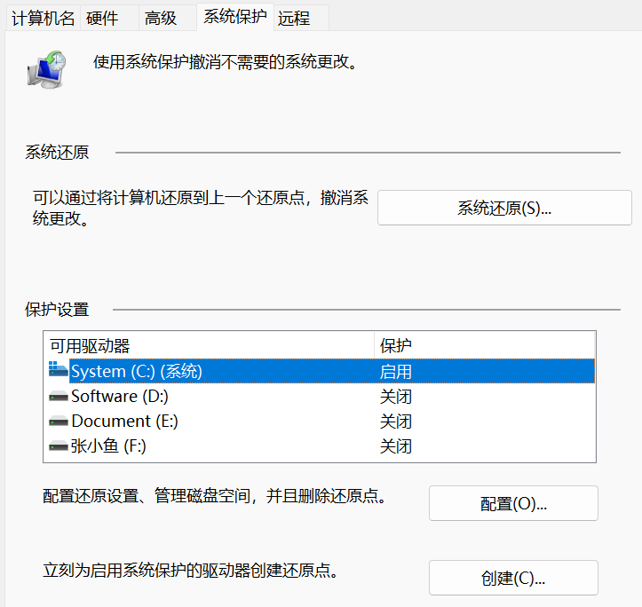
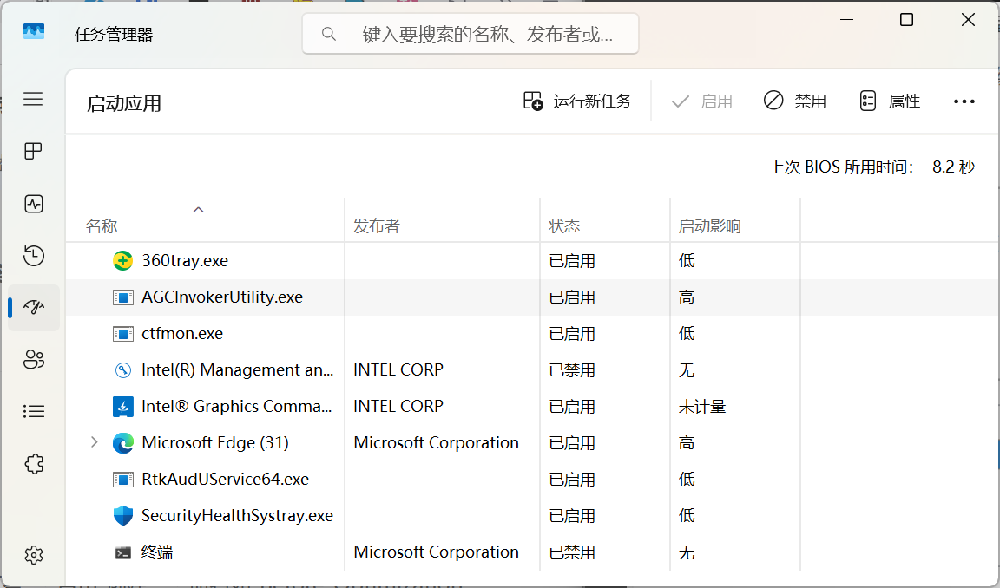
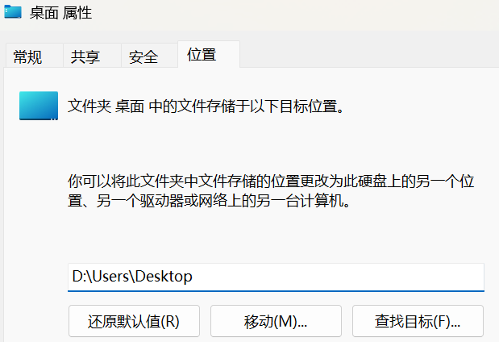
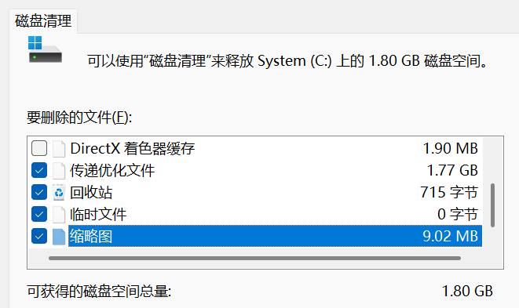
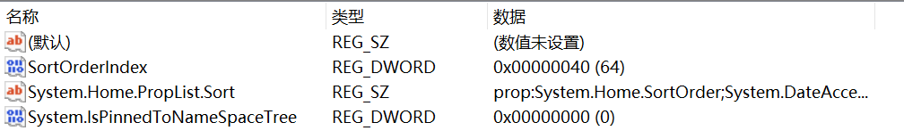
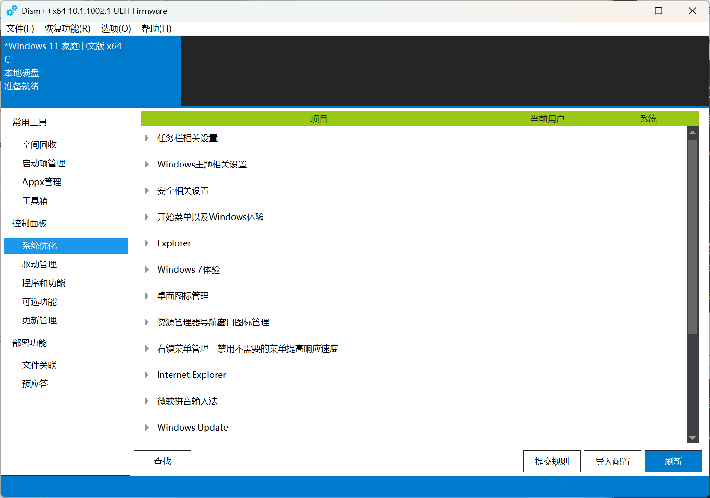

<!--more-->

## 1. 系统基础加固

### 1.1 创建系统还原点

① **打开系统属性**

按`Win+R` 输入 `sysdm.cpl` 回车 → 切换到"系统保护"选项卡

② **配置还原设置**

选择 C 盘 → 点击"配置" → 选择"启用系统保护" → 设置磁盘空间使用量（建议5-10%）

③ **创建还原点**

点击"创建" → 输入描述（如"Before_Optimization"）→ 等待创建完成。

`Win+R` 输入 `sysdm.cpl`，打开系统属性，切换到“系统保护”，选择 C 盘，点击“配置” -> “创建”，命名如“Before_Optimization”。



### 1.2 禁用开机自启项

`Ctrl+Shift+ESC` 打开任务管理器，点击“启动”，禁用所有非必要程序，保留 HP 相关和杀毒软件。



## 2. C 盘空间优化

### 2.1 转移系统文件夹

`Win+E` 打开“文件资源管理器”，右键需要移动的文件夹（如“桌面”），选择“属性”，切换到“位置”，然后在 D 盘创建对应的文件夹，示例如下：

```text
桌面
C:\Users\<你的用户名>\Desktop → D:\Users\<你的用户名>\Desktop
下载
C:\Users\<你的用户名>\Downloads → D:\Users\<你的用户名>\Downloads
文档
C:\Users\<你的用户名>\Documents → D:\Users\<你的用户名>\Documents
……
```

回到“位置”选项卡，点击“移动”，选择刚创建的文件夹，点击“应用”，弹出确认窗口时选择“是”，自动迁移现有文件。



重复操作转移其他文件夹，如下载、文档、图片、音乐等。

> 📌 注意：
>
> - 迁移前，确保 D 盘有足够空间（至少 50GB），同时关闭正在使用的文件。
> - 移动前一定要先创建对应文件夹，未创建不要移动。
> - 目标文件夹名称与系统默认一致，避免使用中文或特殊符号。
> - 若不慎移动至 D 盘根目录，最简单的操作是再次重装。

### 2.2 一键清理垃圾

`Win+R` 输入`cleanmgr`，选择 C 盘，勾选除“windows 错误报告和反馈诊断”、“DirectX 着色器缓存”之外的选项。点击“清理系统文件”（需要管理员权限），再次勾选上述选项，最后点击“确定”，选择“删除文件”。



> 📌 注意：
>
> - 慎选“下载”文件夹，如果未迁移，清理会删除该文件夹的所有文件。
> - 如果缩略图出现空白，单独清理“缩略图”可重建缓存，之后重启“文件资源管理器”即可。

## 3. 性能调优

### 3.1 调整电源模式

`Win+I` 打开系统设置，选择“系统” -> “电源和电池” -> “电源模式”，选择“最佳性能”。


### 3.2 隐藏主文件夹和图库

`Win+S` 选择“终端管理员”，输入 `regedit.exe`，定位到以下注册表项：

```text
主文件夹（Home）
HKEY_CLASSES_ROOT\CLSID\{f874310e-b6b7-47dc-bc84-b9e6b38f5903}

图库（Gallery）
HKEY_CLASSES_ROOT\CLSID\{e88865ea-0e1c-4e20-9aa6-edcd0212c87c}
```

注册表项右键选择“权限”，点击“高级”，将“所有者”更改为“Authenticated Users”，并为“Administrators”分配“完全控制”权限。

回到注册表编辑器，将“System.IsPinnedToNameSpaceTree”改为 0。



修改后，恢复修改前的权限，并将“所有者”改回原始值“NT Service\TrustedInstaller”。

### 3.3 Dism++ 系统优化

[Dism++](https://github.com/Chuyu-Team/Dism-Multi-language/releases)（无需安装，解压即用）包含众多系统设置优化项，如切回 win10 右键菜单、隐藏快捷方式小箭头、隐藏资源管理导航窗口图标、开始菜单优化等，根据自己的需求点击右侧的开关按钮来开启或关闭相应的功能。


