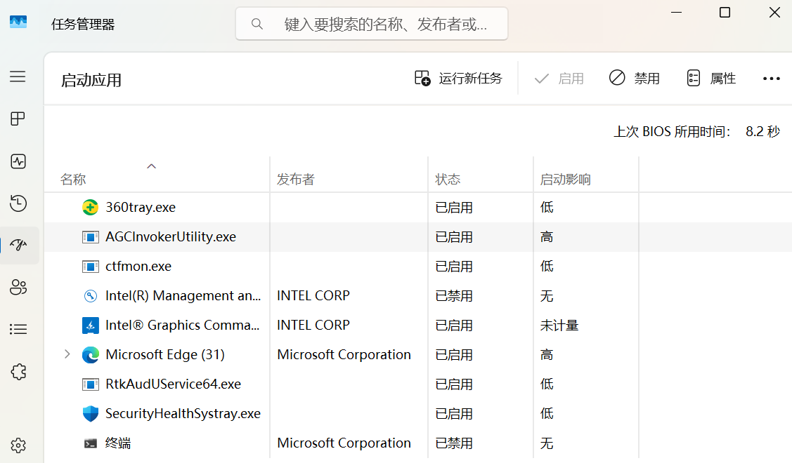

<!--more-->

## 1. 系统基础加固

### 1.1 创建系统还原点

按 `Win+R` 输入 `sysdm.cpl` ，打开系统属性，切换到 “系统保护” ，选择 C 盘，点击 “配置”  → “创建” ，命名如 “Before_Optimization” 。


### 1.2 禁用开机自启项

按 `Ctrl+Shift+ESC` 打开任务管理器，切换到 “启动” 选项卡，禁用所有非必要程序，保留 HP 相关和杀毒软件。



## 2. C 盘空间优化

### 2.1 系统文件夹迁移

按 `Win+E` 打开 “文件资源管理器” ，右键需要移动的文件夹（如 “桌面” ），选择 “属性” ，切换到 “位置” ，然后在 D 盘创建对应的文件夹。示例如下：

```text
桌面
C:\Users\<你的用户名>\Desktop → D:\Users\<你的用户名>\Desktop
下载
C:\Users\<你的用户名>\Downloads → D:\Users\<你的用户名>\Downloads
文档
C:\Users\<你的用户名>\Documents → D:\Users\<你的用户名>\Documents
……
```

回到 “位置” 选项卡，点击 “移动” ，选择刚创建的文件夹，点击 “应用” ，弹出确认窗口时选择 “是” ，等待文件迁移完成。


重复以上操作迁移其他文件夹，如下载、文档、图片、音乐等。

> 📌 **注意事项**：
>
> - 操作前关闭所有正在使用的文件。
> - 确保 D 盘有 ≥50GB 可用空间。
> - 文件夹名称保持英文（避免中文 / 特殊符号）。

### 2.2 一键清理垃圾

按 `Win+R` 输入 `cleanmgr` ，选择 C 盘，勾选除 “windows 错误报告和反馈诊断”、“DirectX 着色器缓存” 之外的选项。点击 “清理系统文件”（需要管理员权限），再次勾选上述选项，最后点击 “确定” ，选择 “删除文件” 。


> 📌 注意事项：
>
> - 慎选 “下载” 文件夹，如果未迁移，清理会删除该文件夹的所有文件。
> - 如果缩略图出现空白，单独清理 “缩略图” 并重启 “文件资源管理器” 。

## 3. 性能调优

### 3.1 电源模式优化

按 `Win+I` 打开系统设置，选择 “系统” → “电源和电池” → “电源模式”，将电源模式设置为 “最佳性能” 。


### 3.2 隐藏主文件夹和图库

按 `Win+S` 搜索 “终端管理员” ，输入 `regedit.exe` ，定位到以下注册表项：

```text
主文件夹（Home）
HKEY_CLASSES_ROOT\CLSID\{f874310e-b6b7-47dc-bc84-b9e6b38f5903}

图库（Gallery）
HKEY_CLASSES_ROOT\CLSID\{e88865ea-0e1c-4e20-9aa6-edcd0212c87c}
```

注册表项右键选择 “权限” ，点击 “高级” ，将 “所有者” 更改为 “Authenticated Users” ，并为 “Administrators” 分配 “完全控制” 权限。

回到注册表编辑器，将 `System.IsPinnedToNameSpaceTree` 改为 `0` 。


修改后，恢复修改前的权限，并将 “所有者” 改回原始值 “NT Service\TrustedInstaller” 。

### 3.3 Dism++ 系统优化

[Dism++](https://github.com/Chuyu-Team/Dism-Multi-language/releases)（无需安装，解压即用）包含众多系统设置优化项，如切回 Win10 右键菜单、隐藏快捷方式小箭头、隐藏资源管理导航窗口图标、开始菜单优化等，根据自己的需求点击右侧的开关按钮来开启或关闭相应的功能。


